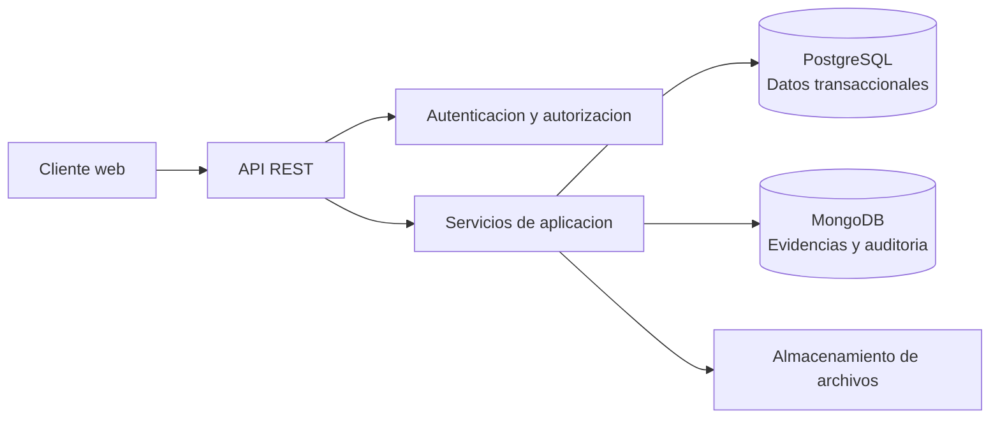
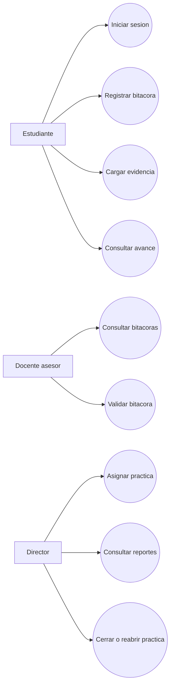
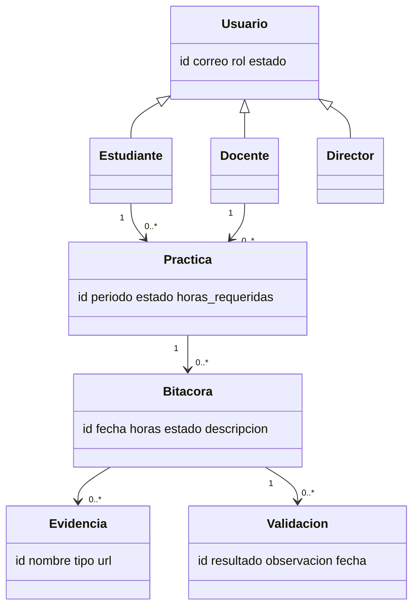
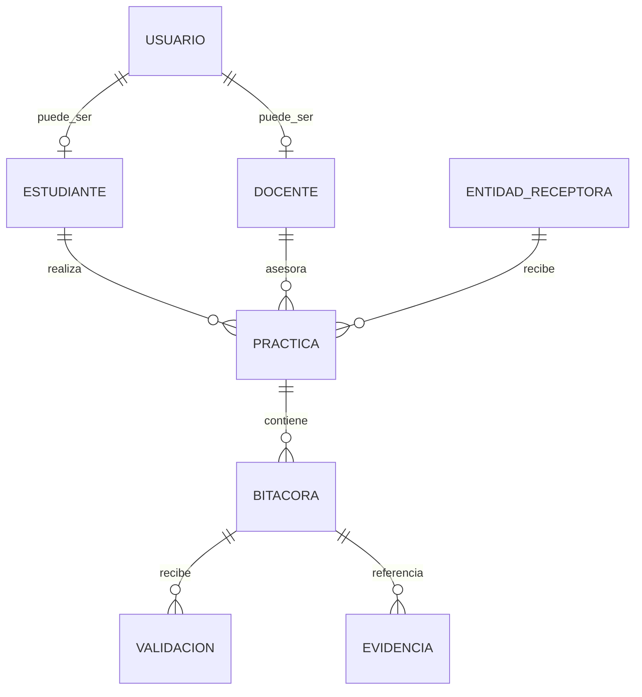
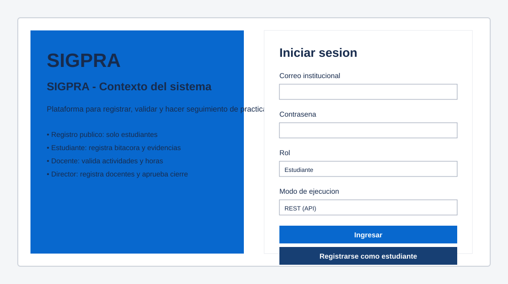
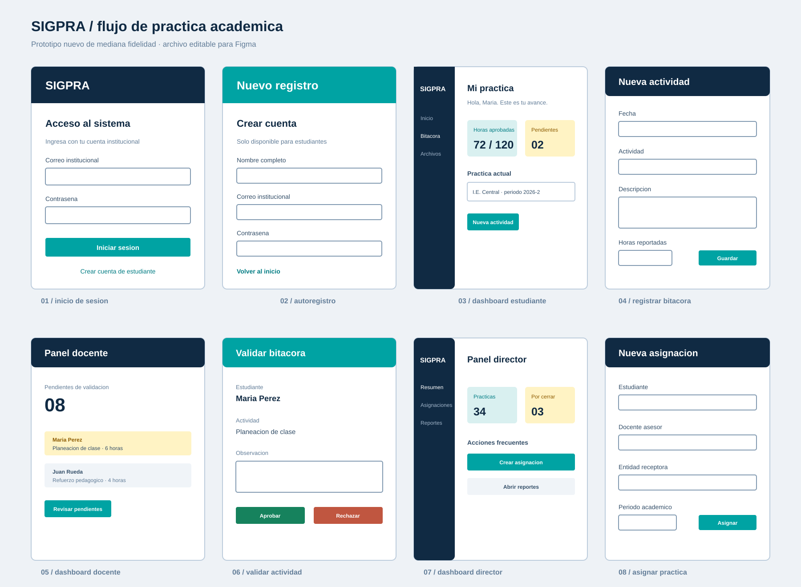

# Primera entrega - SIGPRA
## Sistema Integral de Gestion de Practicas Academicas

**Programa:** Ingenieria de Sistemas  
**Periodo:** II - 2026  
**Semestre:** Quinto  
**Cursos vinculados:** Ingenieria del Software II, Programacion III y Teoria General de Sistemas

> Documento actualizado para la primera entrega. Reemplaza el enfoque anterior de Java Swing + Oracle por una arquitectura REST con PostgreSQL y MongoDB.

## 1. Introduccion

Las practicas academicas requieren coordinar estudiantes, docentes asesores, directores de programa y entidades receptoras. Cuando la informacion se administra mediante hojas de calculo, correos y archivos separados, se dificulta controlar las horas, validar actividades, conservar evidencias y elaborar informes.

SIGPRA sera una plataforma web con acceso por roles que centralizara el ciclo de vida de la practica: registro del estudiante, asignacion, bitacora, carga de evidencias, validacion docente, cierre e informes. La solucion se implementara mediante una API REST y una arquitectura desacoplada. PostgreSQL almacenara la informacion estructurada y MongoDB almacenara evidencias y eventos de seguimiento.

## 2. Descripcion del problema

El director del programa necesita conocer en tiempo real quienes estan en practica, donde realizan sus actividades, cuantas horas han reportado y que validaciones estan pendientes. El proceso actual presenta:

- Informacion dispersa y duplicada.
- Retrasos en asignaciones y validaciones.
- Dificultad para verificar el cumplimiento de horas.
- Riesgo de perdida de evidencias y observaciones.
- Baja trazabilidad de cambios y decisiones.
- Elaboracion manual de reportes institucionales.

## 3. Objetivos

### 3.1 Objetivo general

Diseñar una plataforma REST para gestionar de forma centralizada, trazable y segura las practicas academicas, integrando PostgreSQL y MongoDB segun la naturaleza de la informacion.

### 3.2 Objetivos especificos

1. Definir los roles y permisos de estudiantes, docentes asesores y directores.
2. Modelar en PostgreSQL usuarios, practicas, asignaciones, bitacoras y validaciones.
3. Modelar en MongoDB evidencias digitales y eventos de auditoria.
4. Disenar una API REST para los flujos principales del sistema.
5. Elaborar requisitos, UML, modelo entidad-relacion y prototipo de mediana fidelidad.
6. Facilitar reportes de horas, estados de practica y pendientes de validacion.

## 4. Justificacion

La solucion reduce la dependencia de archivos aislados y mejora la disponibilidad de informacion para la toma de decisiones. La separacion de responsabilidades entre bases de datos responde a las caracteristicas del dominio: PostgreSQL garantiza integridad referencial en los procesos academicos, mientras MongoDB permite guardar documentos, metadatos variables y eventos sin forzar una estructura rigida.

La arquitectura REST permite que una interfaz web o movil consuma los mismos servicios, facilita las pruebas y mantiene separadas la presentacion, la logica de negocio y la persistencia.

## 5. Alcance de la primera version

### Incluye

- Autenticacion por correo, contrasena y rol.
- Autoregistro de estudiantes.
- Registro y asignacion de practicas.
- Registro de actividades y horas en bitacora.
- Carga y consulta de evidencias.
- Aprobacion o rechazo por docente asesor.
- Consulta de avance y reportes basicos por director.
- Persistencia en PostgreSQL y MongoDB.

### No incluye en esta primera version

- Integracion con sistemas academicos externos.
- Firma digital con certificado.
- Aplicacion movil nativa.
- Calificacion automatica del desempeno.

## 6. Plan del proyecto y arquitectura

| Fase | Actividades | Entregable |
|---|---|---|
| Analisis | Actores, problema, alcance, requisitos y reglas de negocio | Documento de requisitos |
| Diseno | UML, modelo ER, modelo relacional, colecciones MongoDB y prototipo | Diagramas y prototipo |
| Construccion | API REST, autenticacion, persistencia y modulos por rol | Prototipo funcional |
| Pruebas | Pruebas de endpoints, CRUD y reglas de negocio | Evidencias de prueba |
| Cierre | Manuales, release, informe, articulo y video | Entrega final |

### 6.1 Arquitectura propuesta

Se propone una arquitectura en capas con API REST:

- **Presentacion:** cliente web responsivo por rol.
- **API REST:** endpoints JSON, validacion de entrada y codigos HTTP.
- **Aplicacion:** casos de uso, reglas de horas, permisos y estados.
- **Persistencia:** repositorios separados para PostgreSQL y MongoDB.
- **Seguridad:** contrasenas con hash, JWT, autorizacion por rol y validacion de archivos.

### 6.2 Convenciones REST

| Recurso | Metodos principales |
|---|---|
| `/api/v1/auth` | `POST /login`, `POST /registro` |
| `/api/v1/usuarios` | `GET`, `POST`, `PATCH` |
| `/api/v1/practicas` | `GET`, `POST`, `PATCH` |
| `/api/v1/bitacoras` | `GET`, `POST`, `PATCH` |
| `/api/v1/evidencias` | `GET`, `POST`, `DELETE` |
| `/api/v1/validaciones` | `GET`, `POST` |
| `/api/v1/reportes` | `GET` |

Las respuestas deben usar JSON, paginacion en consultas de listas, `201` al crear, `200` al consultar o actualizar, `204` al eliminar, `400` para datos invalidos, `401` para falta de autenticacion, `403` para permisos insuficientes y `404` cuando no exista el recurso.

## 7. Analisis de requerimientos

### 7.1 Actores

- **Estudiante:** se registra, consulta su practica, registra bitacoras, carga evidencias y revisa observaciones.
- **Docente asesor:** consulta practicas asignadas, revisa bitacoras, valida o rechaza actividades y registra observaciones.
- **Director:** administra docentes, asigna practicas, consulta reportes y aprueba o reabre cierres.

### 7.2 Requisitos funcionales

| ID | Requisito |
|---|---|
| RF01 | El sistema debe autenticar usuarios y emitir un token segun su rol. |
| RF02 | El estudiante debe poder realizar su autoregistro. |
| RF03 | El director debe poder crear una practica y asignar estudiante, docente, entidad y periodo. |
| RF04 | El estudiante debe poder registrar fecha, actividad, descripcion y horas. |
| RF05 | El estudiante debe poder asociar evidencias a una bitacora. |
| RF06 | El docente debe poder aprobar o rechazar una bitacora con observacion. |
| RF07 | El director debe poder consultar el avance de horas por estudiante y periodo. |
| RF08 | El director debe poder cerrar o reabrir una practica segun horas validadas. |
| RF09 | El sistema debe conservar eventos de auditoria de operaciones relevantes. |
| RF10 | El sistema debe permitir filtrar practicas por estado, programa y periodo. |

### 7.3 Requisitos no funcionales

- RNF01: la API debe responder en menos de 2 segundos para consultas normales de hasta 100 registros.
- RNF02: las contrasenas nunca se almacenaran en texto plano.
- RNF03: cada endpoint protegido debe validar JWT y permisos por rol.
- RNF04: los datos de PostgreSQL deben conservar integridad referencial.
- RNF05: las evidencias deben validar extension, tamano y propietario.
- RNF06: la API debe documentarse mediante OpenAPI/Swagger.
- RNF07: el sistema debe registrar errores sin exponer informacion sensible.

### 7.4 Reglas de negocio

- RB01: un correo solo puede pertenecer a un usuario activo.
- RB02: solo el estudiante propietario puede modificar una bitacora en estado `PENDIENTE`.
- RB03: una bitacora rechazada debe incluir observacion del docente.
- RB04: solo las bitacoras aprobadas suman al total de horas.
- RB05: una practica cerrada no acepta nuevas bitacoras salvo que el director la reabra.
- RB06: una evidencia debe pertenecer a una bitacora existente.

## 8. Diseno UML

### 8.1 Casos de uso principales

### 8.2 Modelo de dominio

## 9. Modelado de base de datos

### 9.1 Criterio de distribucion

**PostgreSQL:** usuarios, programas, entidades receptoras, practicas, asignaciones, bitacoras y validaciones. Son datos estructurados con relaciones y reglas de integridad.

**MongoDB:** documentos de evidencias y coleccion de auditoria. Estos datos pueden tener metadatos diferentes segun el tipo de archivo y crecen de forma independiente.

### 9.2 Modelo entidad-relacion

Diagrama visual: `modelo_entidad_relacion.svg`.

El script ejecutable de PostgreSQL se encuentra en `schema.sql` y el modelo de colecciones en `collections.js`.

## 10. Prototipo de mediana fidelidad

Pantallas propuestas:

1. Inicio de sesion por rol.
2. Autoregistro de estudiante.
3. Dashboard del estudiante con horas aprobadas, pendientes y alertas.
4. Formulario de bitacora y carga de evidencia.
5. Dashboard del docente con bitacoras pendientes.
6. Vista de validacion con aprobar, rechazar y observacion.
7. Dashboard del director con asignaciones, estados y reportes.
8. Formulario de asignacion de practica.

La navegacion debe usar menu lateral contextual, tablas con filtros, formularios con validacion y mensajes claros de exito o error. El prototipo navegable esta en `prototipo_mediana_fidelidad.html` y los diagramas independientes en `diagramas_primera_entrega.md`.

Las ocho pantallas nuevas para construir el prototipo en Figma estan reunidas en `prototipo_figma_nuevo.svg`.

## 11. Anexos y referencias

- Anexo A: diagrama de casos de uso.
- Anexo B: modelo de dominio y entidad-relacion.
- Anexo B1: diagrama visual del modelo entidad-relacion (`modelo_entidad_relacion.svg`).
- Anexo E1: pantalla de inicio de sesion (`prototipo_login.svg`).
- Anexo E2: lamina de ocho pantallas para Figma (`prototipo_figma.svg`).
- Anexo C: script PostgreSQL.
- Anexo D: colecciones MongoDB.
- Anexo E: prototipo de mediana fidelidad.

Referencias base: Sommerville (2021), *Software Engineering*; Pressman y Maxim (2020), *Software Engineering: A Practitioner's Approach*; OMG (2017), UML 2.5.1; ISO/IEC 25010:2011.
