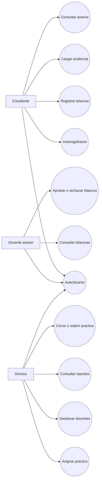
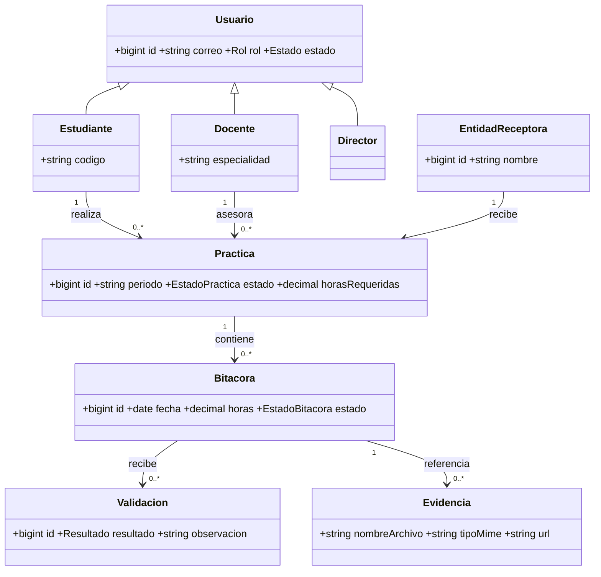
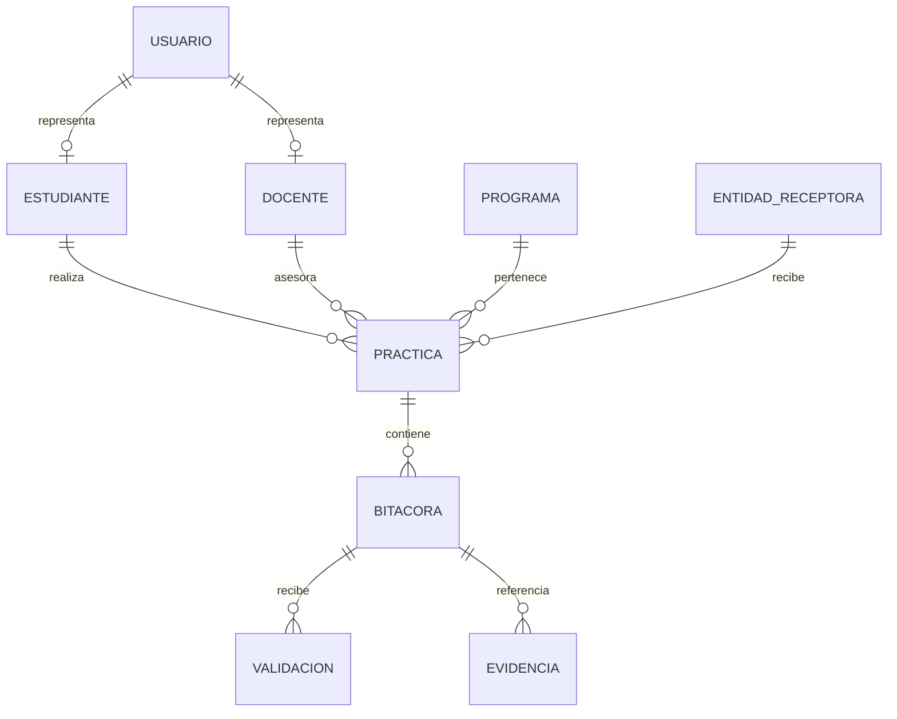
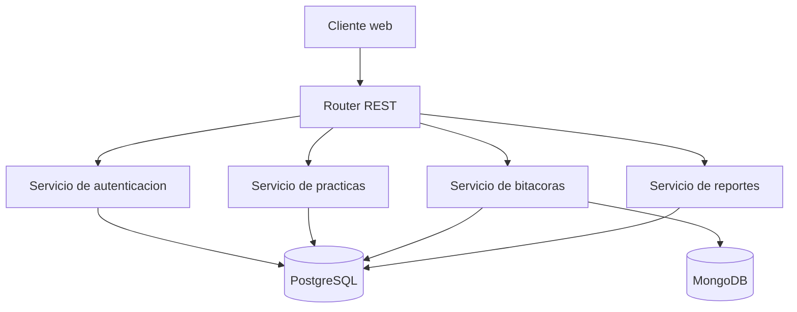
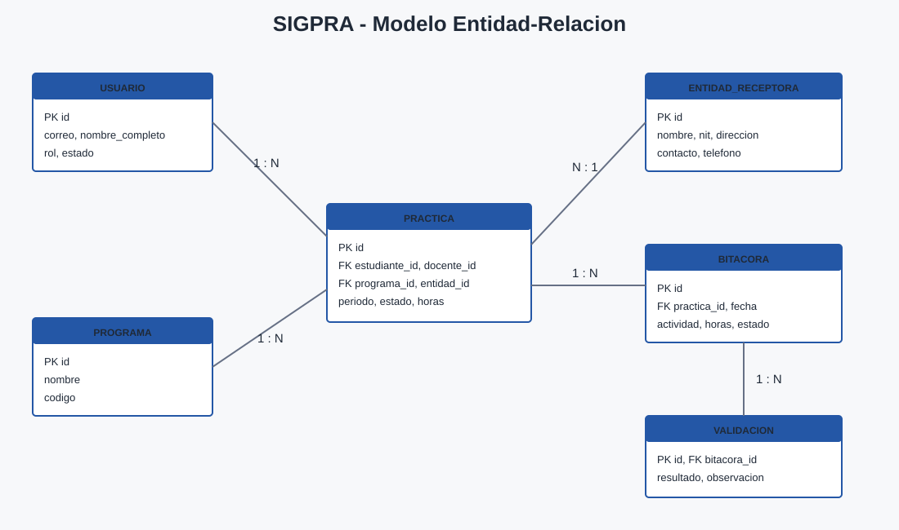

# Diagramas - Primera entrega SIGPRA

## Diagrama de casos de uso

## Diagrama de dominio

## Modelo entidad-relacion

## Arquitectura de componentes

## Modelo entidad-relacion visual

Archivo: `modelo_entidad_relacion.svg`.

## Notas de entrega

- Estos diagramas cubren el alcance de la primera entrega: casos de uso y dominio/ER.
- Componentes, secuencias y despliegue se ampliaran en el segundo avance y la entrega final.
- El prototipo navegable esta en `prototipo_mediana_fidelidad.html`.
